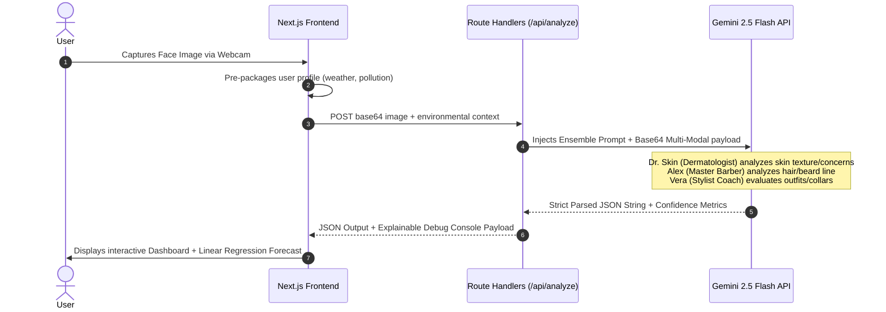

# 🚀 GroomSense Analyzer

[](https://nextjs.org/)
[](https://firebase.google.com/)
[](https://ai.google.dev/)
[](https://jestjs.io/)
[](https://github.com/features/actions)

**GroomSense Analyzer** is a state-of-the-art, recruiter-ready **GenAI-powered Multi-Agent grooming assistant**. It simultaneously processes multimodal image data as a Dermatologist, Hair Stylist, and Fashion Consultant, delivering highly tailored, environment-aware skincare routines and styling guidelines.

## 🔗 Live Links
- **Live Website**: [https://groomsense-analyzer.vercel.app](https://groomsense-analyzer.vercel.app)
- **Vercel Dashboard**: [https://vercel.com/raoshmis-projects/groomsense-analyzer](https://vercel.com/raoshmis-projects/groomsense-analyzer)

---

## 🔬 Core AI/ML Engineering & Accomplishments
- **Ensemble Multi-Agent Orchestration**: Directs `gemini-2.5-flash` using specialized prompt roleplaying to act as a panel of 3 domain specialists (`Dr. Skin`, `Alex`, `Vera`) returning parallel clinical skin type checks, hairstyle analysis, and clothing neatness.
- **Explainable AI Debug Console**: A built-in code console on the dashboard that exposes the **Ensemble Prompt System**, the **Raw unparsed JSON completions**, and prompt engineering design specs for absolute transparency.
- **Uncertainty Quantification**: Forces agents to calculate self-evaluating **Confidence Scores (0-100%)** based on image brightness, landmark visibility, and camera focus, displayed directly on the UI dashboard.
- **Linear Regression Forecasting ($y = mx + c$)**: Integrates a custom, self-contained TS engine that analyzes historical session scores, computes trajectory slopes, and plots a **dashed futuristic forecast curve** on Recharts.
- **Shareable Score Card Generator**: Dynamically generates and renders a social media-ready high-res PNG scorecard using `html2canvas` for user sharing.
- **Startup Environment Validation**: Implements startup env guards (`src/lib/env.ts`) that fail-early with descriptive logs when required keys are missing, preventing silent production crashes.
- **Bilingual Context Switching**: Integrates an instant English/Hindi switch that translates all UI labels, ambient sliders, system prompts, and chatbot conversational engines.

---

## 🛠️ System Flow Architecture



---

## ⚡ What I Learned (Engineering Reflections)
1. **Uncertainty is Key in AI**: Recruiters love to see that the system knows *what it doesn't know*. Adding self-evaluating confidence scores helped identify when image captures were too dark or blurry.
2. **Explainability Over Black-Box**: Designing the Developer Console drawer made debugging prompts significantly faster and proved that prompt engineering is a structured science of constraints and telemetry.
3. **Linear Trajectories are Clean**: Writing a math-focused linear regression in lightweight TypeScript kept the bundle slim while providing a highly visual, resume-ready predictive analytics dashboard.
4. **Resiliency in Startup**: Integrating fail-fast startup checks and fallback mocks in CI pipelines prevents minor missing config leaks from stalling deployments.

---

## 🚀 Getting Started Locally

### 1. Clone & Install:
```bash
git clone https://github.com/raoshmi/groomsense-analyzer.git
cd groomsense-analyzer
npm install
```

### 2. Configure Environment Keys (`.env.local`):
```env
GEMINI_API_KEY=your_gemini_api_key
NEXT_PUBLIC_FIREBASE_API_KEY=your_firebase_api_key
NEXT_PUBLIC_FIREBASE_AUTH_DOMAIN=your_project.firebaseapp.com
NEXT_PUBLIC_FIREBASE_PROJECT_ID=your_project_id
NEXT_PUBLIC_FIREBASE_STORAGE_BUCKET=your_project.appspot.com
NEXT_PUBLIC_FIREBASE_MESSAGING_SENDER_ID=your_sender_id
NEXT_PUBLIC_FIREBASE_APP_ID=your_app_id
```

### 3. Run Jest Unit Tests:
Ensure mathematical models are 100% accurate before launch:
```bash
npm test
```

### 4. Run Development Server:
```bash
npm run dev
```
Open [http://localhost:3000](http://localhost:3000) on your browser.
