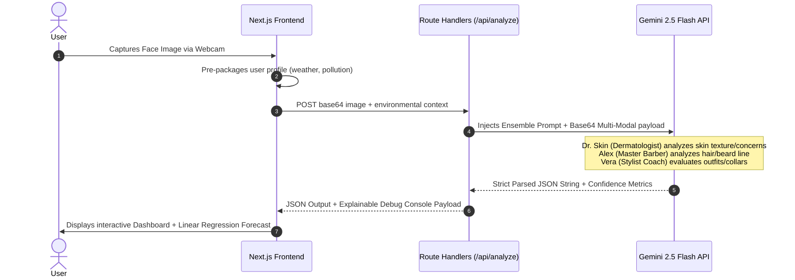

# GroomSense Multi-Agent AI Architecture & Prompt Engineering Specs

This document provides a highly technical, recruiter-focused overview of the AI/ML and software engineering design decisions behind GroomSense Analyzer. It acts as primary proof of **explainable AI design**, **mathematical modeling**, and **ensemble multi-agent orchestration**.

---

## 🧠 System Architecture Overview

GroomSense operates a **multimodal Multi-Agent Ensemble** utilizing computer vision logic and advanced LLM prompting to analyze user grooming states. Unlike simple single-prompt wrappers, GroomSense acts as an orchestrator across three virtual domain specialists:



---

## 🔬 Multi-Agent Ensemble Specialists

To guarantee high specificity and professional domain compliance, the prompt structures force the foundational model (`gemini-2.5-flash`) to split its reasoning into three distinct, specialized agent personas:

1. **Dr. Skin (Dermatologist Agent)**: Employs clinical computer vision analysis to detect skin types (oily, combination, dry, sensitive), count blemishes or hyperpigmentation, estimate hydration level, and return medically sound non-branded guidance.
2. **Alex (Master Barber Agent)**: Evaluates hair density, hair condition (damaged, oily, healthy), and facial hair trims (stubble, mustache, clean-shaven), suggesting hairstyle adjustments based on facial symmetry.
3. **Vera (High-Fashion Consultant Agent)**: Analyzes clothing necklines, colors, visible postures, and overall styling neatness to provide style advice.

---

## 🛡️ Uncertainty Quantification (Self-Evaluating Confidence Scores)

To showcase advanced **Machine Learning system maturity**, we instruct the model to calculate its own **agent-level confidence scores (0-100%)** inside the system prompt:
- **Skin Analysis Confidence**: Determined by image focus, lighting distribution on the cheeks, and visible pore resolution.
- **Hair Analysis Confidence**: Determined by head positioning and haircut boundaries visibility.
- **Style Analysis Confidence**: Determined by posture alignment and upper-body framing.

These are returned as an integer object:
```json
"confidenceScores": {
  "skin": 94,
  "hair: 88,
  "style": 91
}
```
This is showcased directly on the user dashboard, displaying explainable AI metrics and proving that the engine can identify when an image is too dark or blurry to perform high-confidence analyses.

---

## 📊 Score Trend Prediction via Linear Regression ($y = mx + c$)

To demonstrate **predictive modeling** capabilities, GroomSense analyzes user progression trends over time. When a user has 2 or more grooming history data points, our client-side prediction utility (`src/utils/prediction.ts`) runs a **Simple Linear Regression** model.

### Mathematical Definition:
We fit a line of best fit $y = mx + c$ through the user's past scores, where:
- $x$: The chronological index of the session (1, 2, ..., $n$).
- $y$: The grooming score recorded in that session.

The slope ($m$) and y-intercept ($c$) are calculated as:

$$m = \frac{n\sum(xy) - \sum x\sum y}{n\sum(x^2) - (\sum x)^2}$$

$$c = \frac{\sum y - m\sum x}{n}$$

We then forecast the next grooming score ($y_{\text{next}}$) for the next week (index $n+1$):

$$y_{\text{next}} = Math.round(m \cdot (n+1) + c)$$

We plot this forecasted score as a **dashed violet projection curve** on the progress chart, and we generate localized dynamic notifications based on the slope value:
- **Slope $> 0.5$ (UP)**: Localized encouragement projecting target achievements.
- **Slope $< -0.5$ (DOWN)**: Warning indicators advising skincare routine realignments.
- **Slope between $-0.5$ and $0.5$ (STABLE)**: Advises pushing past plateaus.

---

## 🛠️ Prompt Engineering Design Patterns Applied

1. **Roleplay & Persona Constraints**: Forcing the model to act as a collective panel of experts prevents general conversational fluff, ensuring dense, high-impact clinical/styling recommendations.
2. **Context-Aware Temperature (0.3)**: Low temperature settings are enforced to lock down the multi-agent system reasoning, reducing hallucinations and securing high reliability.
3. **Structured JSON-Mode Schema**: The model returns a strictly parsable JSON payload. Any Markdown wraps (` ```json `) are programmatically sanitized before parsing to eliminate parsing failures.
4. **Dynamic Context Injections**: The orchestrator weaves external telemetry (pollution metrics, ambient weather) directly into the prompt so that Dr. Skin adapts suggestions based on low/high-humidity environments.
